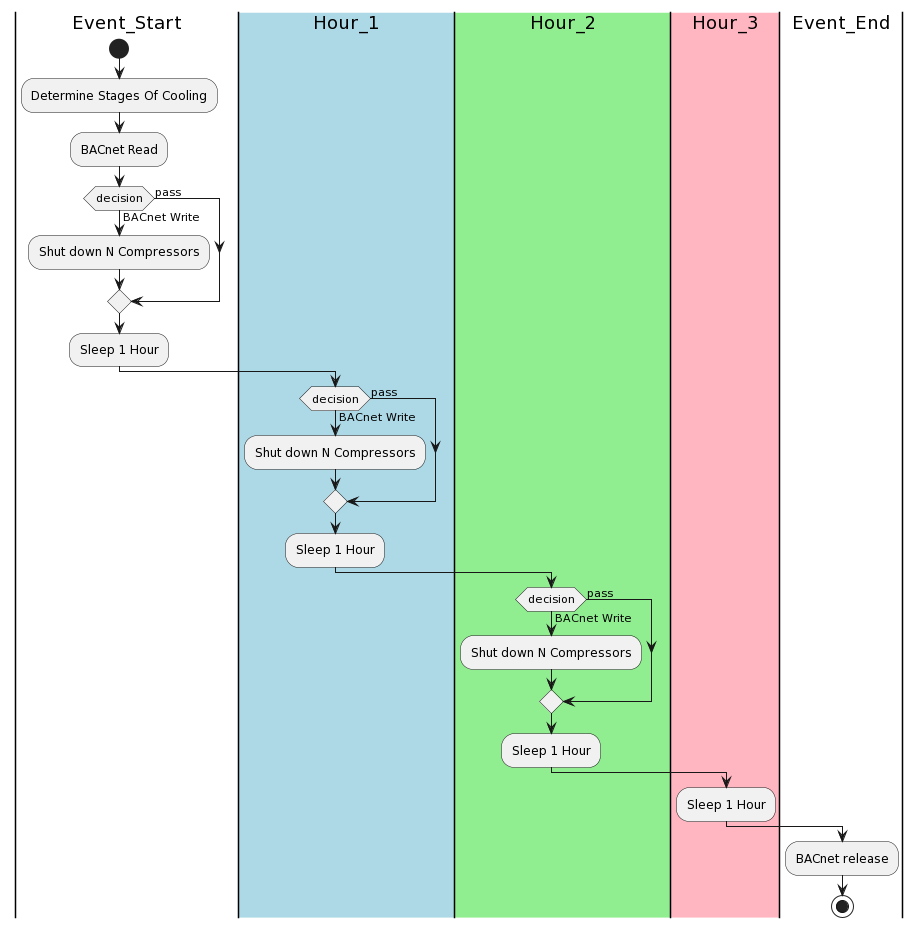

# LOAD SHED with BAC0

* Tested on a variable air volume (VAV) air handling unit (AHU) HVAC system. This AHU has factory packaged BAcnet controls where the 4 cooling compressors are BACnet writeable to enable or disable. The algorithm to turn off comporessors to shed load via BACnet reads/writes. Testing on this AHU measured about 15 kW per compressor.

