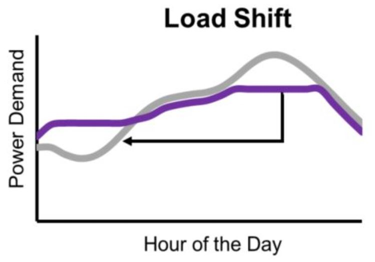

# LOAD SHIFT 



A random Forest Classifier for Multi-Class Action Classification is fit using regression and attempts to find classify  optimized windows of times to shift electrical loads to morning hours of the day. First training data is derived by `feature_engineer.py` which calls a function called `calculate_target` that outputs an additional column in the pandas df called `action` of integer values from 0, 1, 2, or a 3 that is represented in the `action_mapping` dictionary below:

```python
action_mapping = {
    `no_action_required`: 0,
    `building_precooling_start`: 1,
    `load_shifting_idle`: 2,
    `float_setpoints_upward`: 3
}
```

The loads would be shifted by precooling the building and floating the HVAC setpoints upward during hi load hours where the idea is to take the load off of the cooling plant during this window of time. `load_shifting_idle` is the window of time in between precooling and floating setpoints upward where what to do during this time is controversial. One idea could be to turn the boiler off if it is a VAV AHU with hot water reheat system not running the boiler at all may yeild best results. `no_action_required` required at all would be an action of skipping any load shifting operations, this is set in the rule based logic described below based weather forecast information.

`calculate_target` in `feature_engineer.py` is set by rule based logic. The function takes a DataFrame df, along with two parameters: `MIN_LOAD_SHIFT_START_HOUR` and `HIGH_POWER_THRESHOLD`. The function performs calculations to determine the appropriate action label for each row in the DataFrame based on certain conditions.

By default, all rows are initially labeled as `no_action_required`. The function then identifies the indices in the DataFrame where the building power exceeds the `HIGH_POWER_THRESHOLD`. These indices correspond to high power consumption periods.

Next, the function calculates the start times for two specific actions: `float_setpoints_upward` and `load_shifting_idle`. The start times are determined by subtracting specific time offsets from the indices of high power consumption periods. The `float_setpoints_upward` action starts 4 hours before the high power consumption, while the `load_shifting_idle` action starts 2 hours before.

The appropriate action labels are then assigned to the DataFrame at the calculated start indices. The `building_precooling_start` label is assigned to the rows corresponding to the calculated `float_setpoints_upward` start indices, and the `load_shifting_idle` label is assigned to the rows corresponding to the calculated `load_shifting_idle` start indices.

The function checks the minimum timestamp among the high power indices and compares its time value with the `MIN_LOAD_SHIFT_START_HOUR`. If the time is earlier than `MIN_LOAD_SHIFT_START_HOUR`, the high power indices are filtered to include only those with a time greater than or equal to `MIN_LOAD_SHIFT_START_HOUR`.

Finally, the function maps the action labels to a numerical scale using the action_mapping dictionary. The mapping replaces the action labels in the DataFrame with their corresponding numerical values.


The RandomForestClassifier is capable of handling both binary classification and multi-class classification problems. In the case of this multi-class classification task, the RandomForestClassifier automatically handles the mapping of model outputs to the corresponding action labels based on the provided action_mapping.

The model is trained on a given dataset consisting of various features related to the action labels. After training, the model can make predictions and assign action labels to new instances. The output of the model is a numerical label, representing one of the four possible actions: `no_action_required`, `building_precooling_start`, `load_shifting_idle`, or `float_setpoints_upward`. The action_mapping dictionary is used to map the numerical labels back to their corresponding action names for easier interpretation and understanding.

By utilizing the RandomForestClassifier and the provided action_mapping, this code provides a solution for multi-class action classification tasks, allowing the model to learn from input features and accurately predict the appropriate action label for new instances.


* TODO test on more data and make into an IoT app with BACnet or rest API to test on live HVAC system

