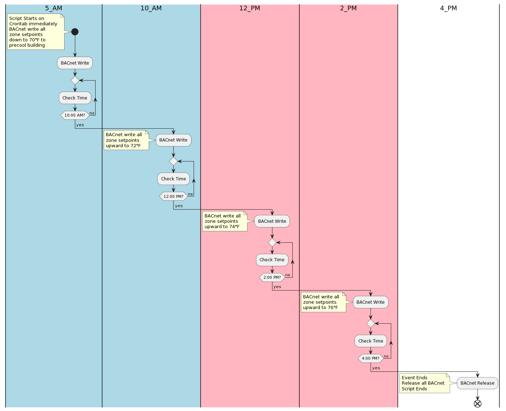

# LOAD SHIFT with BAC0

* Tested on a variable air volume (VAV) air handling unit (AHU) HVAC system. This AHU has factory packaged BAcnet controls where the 4 cooling compressors are BACnet writeable to enable or disable. Testing on this AHU measured about 15 kW per compressor. Load shift attempts are to precool the building by adjusting zone setpoints downward and then slowly raising setpoints throughtout the day. Theory would be that the electrical usage would be most heaviest during morning hours to precool and lighter during the afternoons when setpoints are floated upward. Some cost savings can be incurred if electrical costs are higher in the afternoons. Load shift could consume more electrical energy (kWh) but potentially have lower peaked (kW) electrical power usage that would normally occur late afternoons during peak cooling load on the building.

* Future development for upon script start to check an hourly weather forecast on internet to determine if high temperature for the day would necessitate the need for a load shift event.

