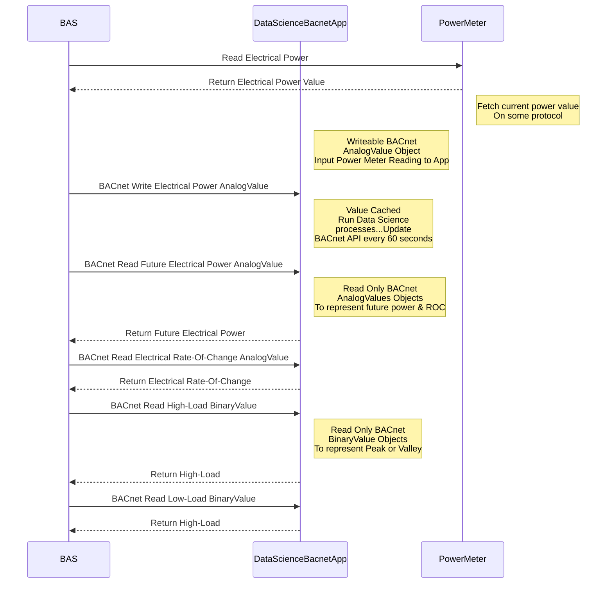

## open-dsm

This project involves the development of a Demand Side Management (DSM) solution tailored for the edge environment within a building. The code emulates a BACnet server running on a Linux distribution of your choice, with the primary objective of offering essential features for the Building Automation System (BAS). These features enable the BAS to execute algorithms aimed at reducing demand charges for the building, managing battery systems, and facilitating electric vehicle PV charging.

When this application is executed, it functions as a discoverable BACnet device that seamlessly integrates into the BAS using the BACnet protocol. Integration is designed to be straightforward, requiring the same skillset used by BAS industry field technicians when setting up HVAC control systems. Once the application is integrated into the BAS, it becomes just another BACnet device within the Building Operations Technology (OT) LAN.

To complete the integration, a BACnet field technician is responsible for inputting the building's electrical power meter value into the application using a writable BACnet point. Afterward, they can implement their choice of DSM logic alongside common BAS logic. Following this step, the BACnet server will manage the following points:

**BACnet Server Analog Value Points**
1. `input-power-meter` (writeable)
2. `one-hour-future-power` (readonly)
3. `power-rate-of-change` (readonly)
4. `model-rsme` (readonly)
5. `model-training-time` (readonly)

**BACnet Server Binary Value Points**
1. `high-load-conditions` (readonly)
2. `low-load-conditions` (readonly)


## Features
* **Time Series Forecasting** : In the `time_series_testing` directory, the application currently utilizes Tensorflow Keras-based LSTM machine learning techniques to forecast power meter readings one hour into the future. This helps in identifying potential power spikes or drops. BAS logic for the DSM algorithm can easily use the data which comes through as the BACnet Analog Value `one-hour-future-power`.
* **Dynamic Model Training** : The system undergoes model training every midnight. This ensures that the model remains up-to-date, adapting to daily variations and subtle changes in the building's electricity usage patterns.
* **High & Low Load Indicators** : Refer to the `pre_project_analysis` directory. The BACnet Binary Values (BVs) are configured to indicate high and low electrical usage based on the 90th and 30th percentiles, respectively. This statistical approach guarantees accurate identification of peak and low power consumption periods. The assumption is that the control system can utilize this data to determine whether the building can accommodate electric vehicle and/or battery system usage. If the data indicates high peak times (90th percentiles), the `high-load-conditions` BACnet point will switch to True (from 0 to 1 in BACnet). Control system logic can then restrict electrical usage, such as charging or cooling plant operations, during peak summertime cooling applications.
* **Solar PV** - TODO
* **Battery State Of Charge (SOC)** - TODO
* **TODO** - create more BACnet points and algorithm under the hood that could integrate battery system SOC, solar PV output, and buildings power usage to determine if chiller plant should capacity limited and/or battery system/electric car charging can be allowed.

## Requirements
- Python 3.10.x or newer
- BACpypes, Numpy, Tensorflow, and the scikit-learn libraries

## Installation
1. **pip install Python libraries**

```bash
pip install scikit-learn bacpypes tensorflow
```

2. **Clone repo, cd into into project directory**
```bash
git clone https://github.com/bbartling/open-dsm.git
```
```bash
cd open-dsm
```

3. (Optional) **run or test script from Linux terminal**
```bash
python bacnet_server.py
```

## Schematic

Update to include a network schematic:
The Building Automation System (BAS) retrieves the current electrical power reading from the building's power meter, using protocols such as Modbus, BACnet, REST, among others. This value, representing the instantaneous electrical power usage (measured in kW, not kWh), is then written to the Data Science BACnet App. Subsequently, the BAS accesses forecasted electrical power data, rate-of-change metrics, and high/low load indicators from BACnet Analog Value and Binary Value objects, respectively. Equipped with this data, the BAS can execute logic to either shed loads or maintain a specific power threshold. This sequence, typically crafted by a consulting engineer, is then brought to fruition by an HVAC controls contractor technician.



### Run `bacnet_server.py` as a linux service

1. **Create a Service Unit File**

   Open a terminal and navigate to the systemd service unit directory:

   ```bash
   cd /etc/systemd/system

   sudo nano bacnet_server.service
   ```

2. **Add the Service Configuration and `EDIT` file as necessary**

   ```bash
   [Unit]
   Description=BACnet Server
   After=network.target

   [Service]
   User=your_username
   WorkingDirectory=/home/your_username/open-dsm
   ExecStart=/usr/bin/python3 bacnet_server.py --debug
   Restart=always

   [Install]
   WantedBy=multi-user.target
   ```
   Replace `your_username` with your actual username.

2. **Save and Exit the Text Editor**
   After adding the configuration, save the file and exit the text editor.

3. **Enable and Start the Service**
   Enable the service to start on boot:
   ```bash
   sudo systemctl enable bacnet_server.service
   ```
   Then, start the service:
   ```bash
   sudo systemctl start bacnet_server.service
   ```
4. **Check the Service Status**
   Check the status of your service to ensure it's running without errors:
   ```bash
   sudo systemctl status bacnet_server.service
   ```
5. **If errors and need to update script**
   If you make changes to the script, stop the service to update it:
   ```bash
   sudo systemctl stop bacnet_server.service
   ```
6. **Start the Service After Updating**
   After making changes to the script, start the service again:
   ```bash
   sudo systemctl start bacnet_server.service
   ```
7. **Check the Updated Status**
   Check the status again to confirm that the updated script is running:
   ```bash
   sudo systemctl status bacnet_server.service
   ```

8. **Tail Linux Service Logs**
   See debug print statements:
   ```bash
   sudo journalctl -u bacnet_server.service -f
   ```

   * Below is an example that updates at 1-minute intervals. The presence of the value `30286.0` confirms that the control system is successfully writing to the `input-power-meter` point in the BACnet API. If the control system were not writing properly, the default BACnet present value would be `-1.0`.:

   ```bash
   Sep 30 09:28:00 vm-bbartling2 python3[296422]: DEBUG:__main__:input_power: 30286.0
   Sep 30 09:28:00 vm-bbartling2 python3[296422]: DEBUG:__main__:one_hr_future_pwr: -1.0
   Sep 30 09:28:00 vm-bbartling2 python3[296422]: DEBUG:__main__:power_rate_of_change: -1.0
   Sep 30 09:28:00 vm-bbartling2 python3[296422]: DEBUG:__main__:high_load_bv: inactive
   Sep 30 09:28:00 vm-bbartling2 python3[296422]: DEBUG:__main__:low_load_bv: inactive
   Sep 30 09:28:00 vm-bbartling2 python3[296422]: DEBUG:__main__:Data Cache Length: 3
   Sep 30 09:28:00 vm-bbartling2 python3[296422]: DEBUG:__main__:Current Hour: 9
   Sep 30 09:28:00 vm-bbartling2 python3[296422]: DEBUG:__main__:Current Minute: 28
   Sep 30 09:28:00 vm-bbartling2 python3[296422]: DEBUG:__main__:Training Started Today: False
   Sep 30 09:28:00 vm-bbartling2 python3[296422]: DEBUG:__main__:Model Availability: False
   Sep 30 09:28:00 vm-bbartling2 python3[296422]: DEBUG:__main__:Model training time: 0.00 minutes on None
   Sep 30 09:28:00 vm-bbartling2 python3[296422]: DEBUG:__main__:Data Cache last value: 30286.0
   Sep 30 09:28:00 vm-bbartling2 python3[296422]: DEBUG:__main__:data_cache_len < 65 - RETURN
   ```

### **Reload Linux service if modifiations are required to the .py file and or Linux service**
   Reload the systemd configuration. This tells systemd to recognize your changes:
   ```bash
   sudo systemctl daemon-reload
   ```

   Restart your service to apply the changes:
   ```bash
   sudo systemctl restart bacnet_server.service
   ```

   Check the status to ensure it's running as expected:
   ```bash
   sudo systemctl status bacnet_server.service
   ```

   See debug print statements:
   ```bash
   sudo journalctl -u bacnet_server.service -f
   ```

## Writeups:

* [linkedin story](https://www.linkedin.com/pulse/bacnet-data-science-app-grafana-ben-bartling%3FtrackingId=LLsyrLv8yC6I4n7lqYF42w%253D%253D/?trackingId=LLsyrLv8yC6I4n7lqYF42w%3D%3D)

## Author

[LinkedIn](https://www.linkedin.com/in/ben-bartling-510a0961/)

## Legal Stuff

**Disclaimer:** The operation and implementation of this application are the sole responsibility of the person who chooses to set it up. The author and affiliates of this app are not liable for any consequences or incidents that may arise from the use of this application.

**Cybersecurity Notice:** This application is designed exclusively for use in operational technology (OT) environments that do not reside on the internet or have internet connectivity. It does not incorporate cybersecurity measures for internet-facing or IoT (Internet of Things) applications. 

Users are advised that the security of the application is limited to its use within isolated OT networks. The creator of this app and its affiliates are not responsible for cybersecurity incidents that result from poor IT practices, misconfiguration, or the use of this application in conjunction with internet-connected devices or applications.

It is essential to acknowledge that any negative outcomes, including but not limited to equipment damage, indoor air quality issues, or personal injuries, are the responsibility of the person or firm who deploys and operates the application within a building. Users are strongly encouraged to thoroughly evaluate and assess the application's suitability for their specific use case, implement appropriate cybersecurity measures where necessary, and take all required precautions to ensure safe and effective utilization.

## License

【MIT License】

Copyright 2023 Ben Bartling

Permission is hereby granted, free of charge, to any person obtaining a copy of this software and associated documentation files (the "Software"), to deal in the Software without restriction, including without limitation the rights to use, copy, modify, merge, publish, distribute, sublicense, and/or sell copies of the Software, and to permit persons to whom the Software is furnished to do so, subject to the following conditions:

The above copyright notice and this permission notice shall be included in all copies or substantial portions of the Software.

THE SOFTWARE IS PROVIDED "AS IS", WITHOUT WARRANTY OF ANY KIND, EXPRESS OR IMPLIED, INCLUDING BUT NOT LIMITED TO THE WARRANTIES OF MERCHANTABILITY, FITNESS FOR A PARTICULAR PURPOSE AND NONINFRINGEMENT. IN NO EVENT SHALL THE AUTHORS OR COPYRIGHT HOLDERS BE LIABLE FOR ANY CLAIM, DAMAGES OR OTHER LIABILITY, WHETHER IN AN ACTION OF CONTRACT, TORT OR OTHERWISE, ARISING FROM, OUT OF OR IN CONNECTION WITH THE SOFTWARE OR THE USE OR OTHER DEALINGS IN THE SOFTWARE.
