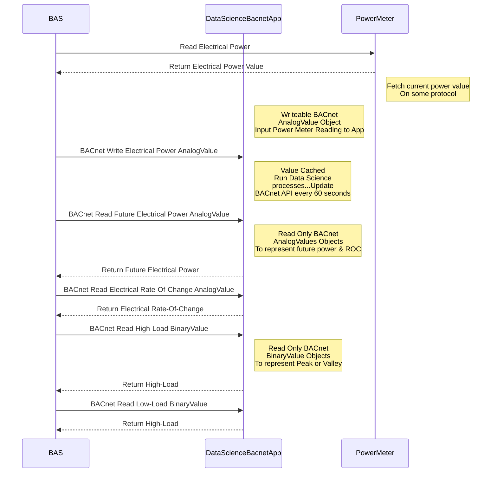

# BACnet server with Sci-kit Learn Integration

use legacy bacpypes version until bacpypes 3 version is stable

## Schematic

Update to include a network schematic:
The Building Automation System (BAS) retrieves the current electrical power reading from the building's power meter, using protocols such as Modbus, BACnet, REST, among others. This value, representing the instantaneous electrical power usage (measured in kW, not kWh), is then written to the Data Science BACnet App. Subsequently, the BAS accesses forecasted electrical power data, rate-of-change metrics, and high/low load indicators from BACnet Analog Value and Binary Value objects, respectively. Equipped with this data, the BAS can execute logic to either shed loads or maintain a specific power threshold. This sequence, typically crafted by a consulting engineer, is then brought to fruition by an HVAC controls contractor technician.

## Writeup:

* [linkedin story](https://www.linkedin.com/pulse/bacnet-data-science-app-grafana-ben-bartling%3FtrackingId=LLsyrLv8yC6I4n7lqYF42w%253D%253D/?trackingId=LLsyrLv8yC6I4n7lqYF42w%3D%3D)