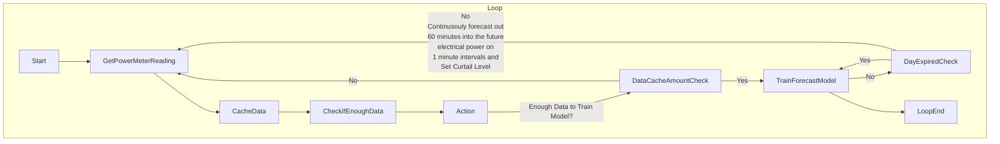
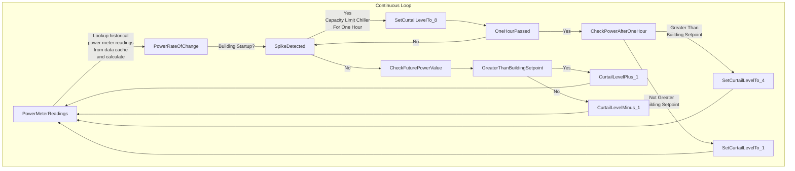

# algorithm

This code deploys a short term one hour time-series forecasting approach for predicting electrical power consumption using a machine learning-based methodology based 
on [this theory](https://machinelearningmastery.com/convert-time-series-supervised-learning-problem-python/) to convert a Time Series data into a Supervised Learning Problem in Python. 
The multi-output forecasting model is trained on historical data and aims to forecast 60 future values based on input features derived from the time series.

The model operates by using the last 60 readings from the time series to predict the next 60-minute interval of electrical power. 
This ensures the model remains adaptive and responsive to the immediate past while predicting the near future. 
The model training aspect operates in this fashion below where the electrical meter reading is read every minute and a new model is 
trained every day to accomodate any changes in how the building utilizes electricity throught different weather patterns 
and or changes to the automation system which would effect power usage such as equipment scheduling versus a fixed model that does not accomodate change.

 
### Algorithm Testing on Historical Data with `ml_forecast.py`

Model	Execution Time (Seconds)
* MLPRegressor: 6276.439391
* RandomForestRegressor: 35259.65835
* KNeighborsRegressor: 8013.53681
* AdaBoostRegressor: 7975.343665
* GradientBoostingRegressor: 14216.92529

Model with lowest MSE and fastest training time:

### **FUTURE IDEA** of a "Curtail Level" on Signal Attributes from a 0 - 8
These could be examples of strategies designed by the consulting engineer and implemented by the controls contractor or systems integrator for control strategy at designated `curtail level`:

0. Allow charging for electrical vehicles or building battery systems
1. Do nothing or Idle
2. HVAC Thermal Zone North Setpoint Adjust Upward + 3°
3. HVAC Thermal Zone East Setpoint Adjust Upward + 3°
4. HVAC Thermal Zone South Setpoint Adjust Upward + 3°
5. HVAC Thermal Zone West Setpoint Adjust Upward + 3°
6. Set back other non-HVAC loads like lighting, close automated blinds, turn one elevator car elevator off, etc.
7. Set back variable AHU system leaving air duct static pressure and temperature setpoints
8. Set Chiller Capacity Limits to 50% via BACnet, override AHU valves to a maximum value of 50%, or + 3° to the chiller plant building loop (evaporator side) setpoint

The primary objective of this prediction mechanism is to actively manage or "curtail" adjustable electrical loads within a building. This predictive capability allows the system to make informed decisions and take proactive measures, ensuring the building aligns with Demand Side Management (DSM) goals.

